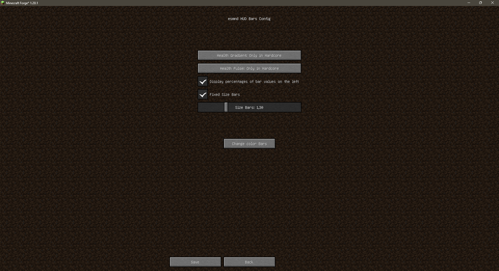
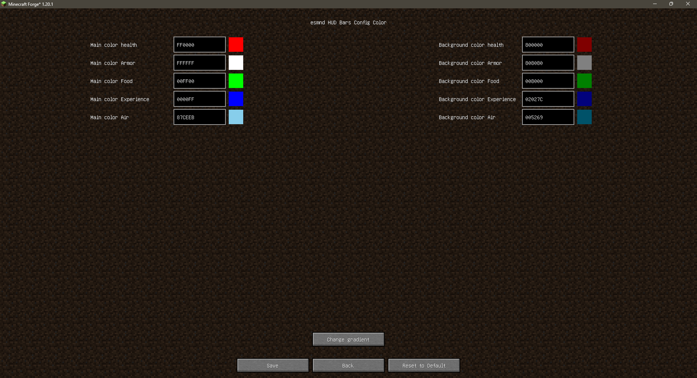
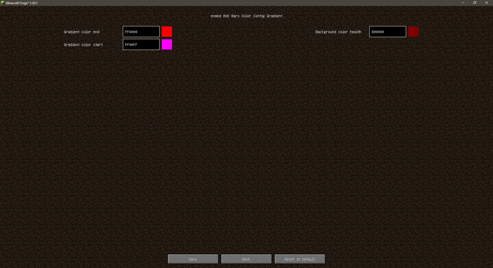
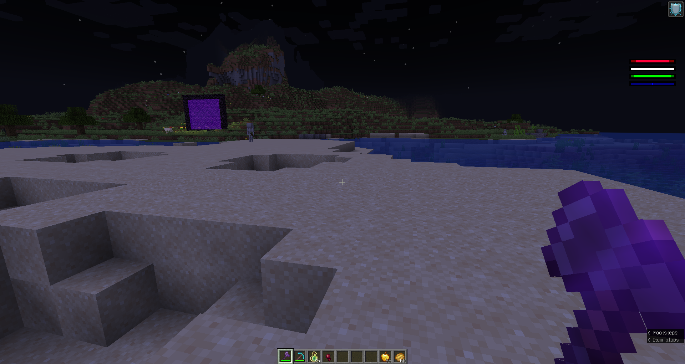
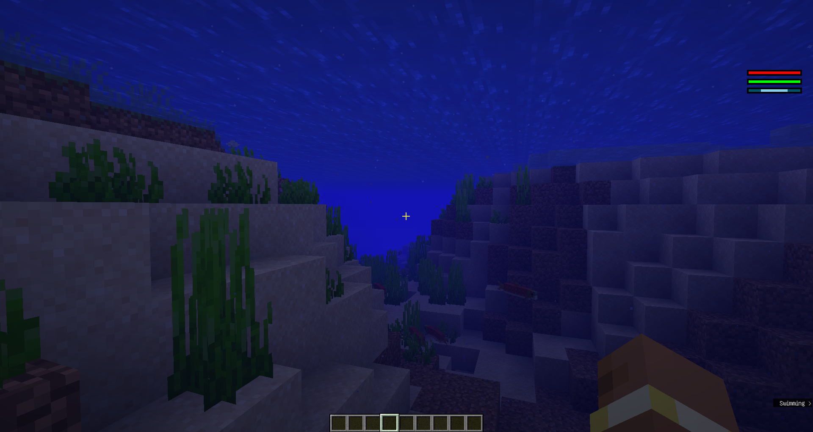
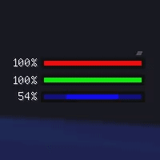
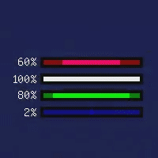

# esmnd HUD Bars 1.16.5

### ПРИМЕЧАНИЕ / NOTE
Модификации в репозитории [esmnd-minecraft-mods](https://github.com/esmnd-minecraft-mods/) написаны с помощью нейросетей(ИИ) Gemini, DeepSeek, Claude

The modifications in the repository [esmnd-minecraft-mods](https://github.com/esmnd-minecraft-mods/) are written with neural networks (AI) Gemini, DeepSeek, Claude

### RUS:
Заменяет стандартный ванильный интерфейс (HUD) Minecraft на настраиваемый и информативный аналог в виде баров. Отображает здоровье, голод, броню, опыт и воздух в виде минималистичных полос с возможностью кастомизации.

## 🌟 Особенности

*   **Кастомные индикаторы:** Заменяет ванильные сердца, голод, броню и опыт на компактные полосы.
*   **Индикатор воздуха:** Полоса опыта автоматически заменяется на индикатор оставшегося воздуха, когда игрок находится под водой.
*   **Настраиваемые цвета:** Изменяйте цвета и цвета фона для каждой полосы через внутриигровое меню конфигурации.
    *   Поддержка градиентов для полосы здоровья (например, для хардкора).
    *   Эффект пульсации при низком уровне здоровья.
*   **Адаптивный или Фиксированный размер:** Будет ли HUD масштабироваться вместе с интерфейсом Minecraft или сохранять постоянный физический размер на экране.
    *   Настройка масштаба для фиксированного режима.
*   **Отображение процентов:** Показывает точный процент заполнения рядом с каждой полосой (кроме воздуха).
*   **Отображение уровня:** Показывает текущий уровень опыта рядом с полосой опыта/воздуха (при открытии инвентаря/level-up).
*   **Плавные анимации:** Значения на полосах изменяются плавно.

### ENG
Replaces Minecraft's standard vanilla HUD with a customizable and informative counterpart like a Bar. Displays health, hunger, armor, experience and air as minimalistic and customizable bars.

## 🌟 Features

* **Custom indicators:** Replaces vanilla hearts, hunger, armor and experience with compact bars.
* **Air Indicator:** The experience bar is automatically replaced with an indicator of remaining air when the player is underwater.
* **Customizable Colors:** Change the colors and background colors for each lane through the in-game configuration menu.
    * Support for gradients for health bars (such as hardcore).
    * Ripple effect when health is low.
* **Adaptive or Fixed Size:** Whether the HUD will scale with the Minecraft interface or keep a constant physical size on the screen.
    * Setting the scale for fixed mode.
* **Percentage value bars:** Shows the exact percentage of fill next to each lane (except air).
* **Level display:** Shows the current experience level next to the experience/air lane (when opening inventory/level-up).
* **Smooth animations:** Values on lanes change smoothly.

## 📸 Скриншоты / GIF

Меню настроек / Config Menu

Меню настроек основных цветов / Menu config main colors

Меню настроек цветов градиента / Menu config gradient colors

Вид интерфейса в игре / Interface in game

Вид интерфейса под водой / Interface when player under water

Анимация работы, также показана анимация работы пульсирования без использования градиента / Animation work, pulse health without gradient

Анимация работы под водой / Animation work under water

Анимация работы пульсирования с градиентом / Animation pulse health with gradient

## 💾 Установка / Install
RUS:
1.  **Установи [Minecraft Forge](https://files.minecraftforge.net/net/minecraftforge/forge/)** для нужной версии Minecraft (**1.16.5.**).
2.  **Скачай** последнюю версию мода `esmndnewhud.jar` со страницы [Releases](https://github.com/esmnd-minecraft-mods/HUD-Bars-1.20.1/releases/tag/1.16.5).
3.  **Помести** скачанный `.jar` файл в папку `mods` внутри твоей папки Minecraft (`%appdata%/.minecraft/mods` на Windows).
4.  **Запусти** Minecraft с установленным профилем Forge.

ENG:
1.  **Install [Minecraft Forge](https://files.minecraftforge.net/net/minecraftforge/forge/)** for the correct version of Minecraft (**1.16.5.**).
2.  **Download** the latest version of the `esmndnewhud.jar` mod from the [Releases](https://github.com/esmnd-minecraft-mods/HUD-Bars-1.20.1/releases/tag/1.16.5) page.
3.  **Place** the downloaded `.jar` file into the `mods` folder inside your Minecraft folder (`%appdata%/.minecraft/mods` on Windows).
4.  **Start** Minecraft with the Forge profile installed.

## ⚙️ Конфигурация / Configuration
RUS:

Настройки мода доступны через меню настроек Forge в игре:
**Главное меню -> Моды -> HUD Bars by esmnd -> Настройки**

Доступные опции:

*   **Режим размера HUD:**
    *   `Ванильный`: Размер HUD зависит от настройки "Интерфейс" в Minecraft.
    *   `Фиксированный`: Размер HUD остается постоянным на экране.
*   **Масштаб фиксированного HUD:** (Доступно только в режиме `Фиксированный`) Позволяет увеличить/уменьшить фиксированный размер HUD.
*   **Настройка Цветов:** Открывает отдельный экран для изменения цветов всех элементов HUD (основной цвет, фон, градиенты для здоровья).
*   **Режим градиента здоровья:** (`Отключен`, `Только в Хардкоре`, `Только в выживании`, `В обоих режимах`)
*   **Режим пульсации здоровья:** (`Отключен`, `Только в Хардкоре`, `Только в выживании`, `В обоих режимах`)

*Файл конфигурации создаётся автоматически*

Конфигурационный файл также можно найти по пути: `.minecraft/config/esmnd_hud_config.json`.

ENG:

The mod settings are available through the Forge settings menu in the game:
**Main Menu -> Mods -> HUD Bars by esmnd -> Config**

Available options:

*  **HUD Size Mode:**
    *   `Vanilla`: HUD size depends on the "Interface" setting in Minecraft.
   *   `Fixed`: The size of the HUD remains constant on the screen.
*  **Fixed HUD Scale:** (Available only in `Fixed` mode) Allows you to increase/decrease the fixed size of the HUD.
* **Color Setting:** Opens a separate screen to change the colors of all HUD elements (main color, background, health gradients).
* **Health Gradient Mode:** (`Disabled`, `Only in Hardcore`, `Only in Survival`, `Both`)
* **Health Ripple Mode:** (`Disabled`, `Only in Hardcore`, `Only in Survival`, `Both`)

*The configuration file is created automatically*

The configuration file can also be found at the path: `.minecraft/config/esmnd_hud_config.json`.

## 🔗 Совместимость / Compatibility
RUS:
*   **Minecraft:** 1.16.5
*   **Загрузчик модов:** Forge от 36.2.34
*   **Другие моды:** Мод изменяет только рендеринг HUD и должен быть совместим с большинством других модов. Однако возможны конфликты с модами, которые *также* изменяют ванильный HUD (например, другие полные переделки интерфейса).

ENG:
*   **Minecraft:** 1.16.5
*   **Mod Loader:** Forge from 36.2.34
*   **Другие моды:** The mod only changes the HUD rendering and should be compatible with most other mods. However, there may be conflicts with mods that *also* modify the vanilla HUD (e.g. other complete interface redesigns).

## 📜 Лицензия
RUS:

Этот мод распространяется под лицензией **MIT License**. См. файл `LICENSE` для полной информации.

Проще говоря, вы можете свободно использовать, изменять, распространять этот мод как угодно, при условии сохранения оригинального уведомления об авторских правах и текста лицензии.

ENG:

This mod is distributed under the **MIT License**. See the `LICENSE` file for full details.

Simply put, you are free to use, modify, distribute this mod in any way you wish, as long as you keep the original copyright notice and license text.
